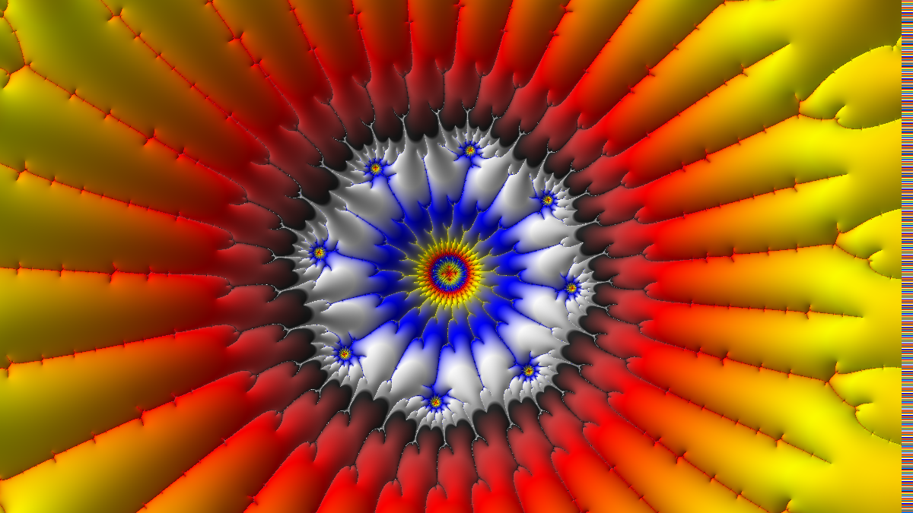
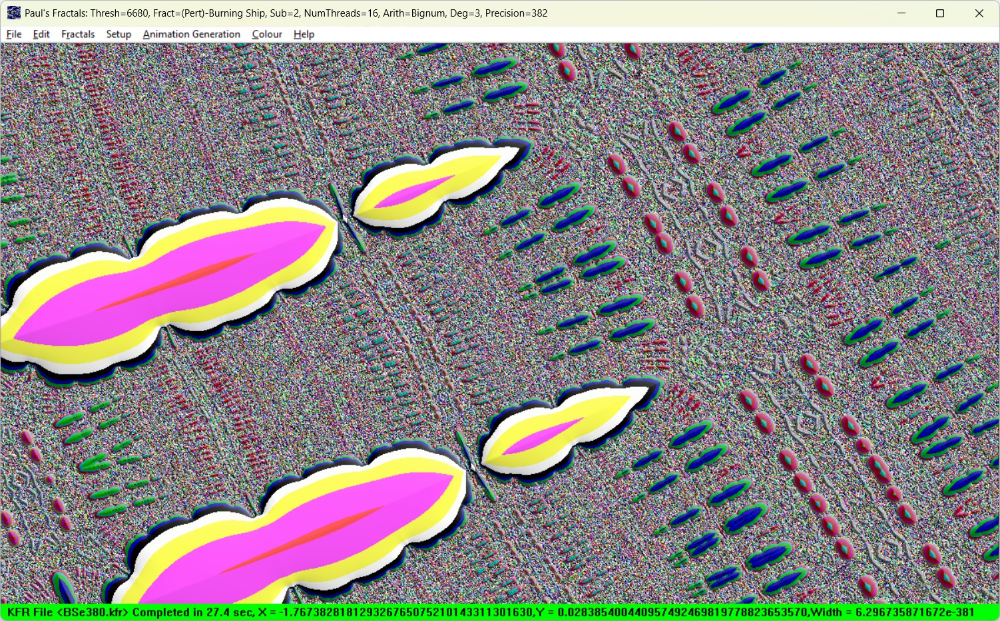
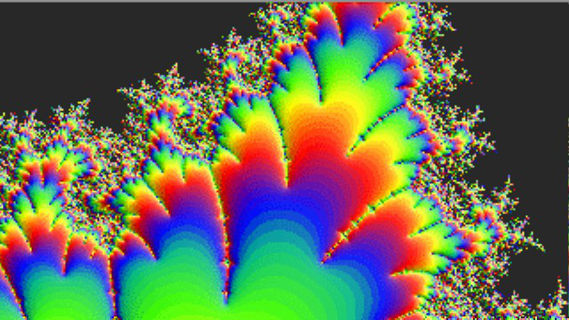

# ManpWIN

ManpWIN is a Windows fractal exploration and rendering application featuring advanced Mandelbrot and related fractal techniques including perturbation, BLA acceleration, slope shading, and a multithreaded formula parser.

This repository contains a fully reproducible CMake-based build system supporting consistent Debug and Release builds with Visual Studio 2022.

---

## ✨ Features

* Mandelbrot and related fractals
* Deep zoom using perturbation theory + BLA acceleration
* BLA (approximation methods) for massive speed improvements
* Multithreaded rendering engine
* Multithreaded formula parser
* Slope derivative rendering modes
* Fractint palette support
* PNG export
* Advanced plotting modes
* High-precision arithmetic (MPFR)
* Preservation of legacy algorithms with modern execution architecture
* True colour rendering
* Support for many fractal types including Mandelbrot, Julia, Burning Ship, and more

---

## 🔬 Use Cases

ManpWIN is designed for both visual exploration and mathematical experimentation:

- Deep zoom Mandelbrot and fractal structure analysis
- Perturbation-based extreme scale rendering
- Investigation of orbit behaviour and numerical stability
- Custom formula experimentation via VM-based parser
- Educational demonstrations of fractal dynamics

---

## 🖼️ Example Output

### High-Precision Fractal Rendering



### ManpWIN Interface



## 🎬 Animation

[](Docs/videos/Jewels.webm)

👉 [Download animation file (WEBM, ~5 MB)](Docs/videos/Jewels.webm)

---

## 📊 Project Status

ManpWIN has reached a stable and reproducible build state with a fully functional multithreaded rendering pipeline.

### Current State

- ✔ Deterministic rendering across Mandelbrot, perturbation, and formula modes
- ✔ Stable multithreaded execution (worklist + parser)
- ✔ Verified Debug and Release builds via CMake + Visual Studio 2022
- ✔ Successful deep zoom exploration
- ✔ Ongoing collaboration and interest from the mathematical community

---

## 🏗️ Build Requirements

- Windows 10/11  
- Visual Studio 2022 (with C++ tools)  
- CMake ≥ 3.23  
- vcpkg installed at:

C:\vcpkg

---

## ⚙️ Build Instructions

### 1. Clone repository

git clone https://github.com/PaulTheLionHeart/manpwin.git
cd manpwin

---

### 2. Configure (CMake + vcpkg)

cmake -B build -S . ^
  -DCMAKE_TOOLCHAIN_FILE=C:/vcpkg/scripts/buildsystems/vcpkg.cmake ^
  -DVCPKG_TARGET_TRIPLET=x64-windows

---

### 3. Build

Release:
cmake --build build --config Release

Debug:
cmake --build build --config Debug

---

### 4. Run

Release:
build\Release\ManpWIN64.exe

Debug:
build\Debug\ManpWIN64.exe

---

### Alternative (recommended)

build_release.bat
build_debug.bat

---

## 📁 Project Structure

```
ManpWIN/
├─ ManpWIN64/     # Main application sources
├─ parser/        # Formula parser engine
├─ pnglib/        # PNG implementation
├─ ZLib/          # Compression support
├─ qdlib/         # Quad-double arithmetic
├─ MPEG/          # MPEG support
├─ CMakeLists.txt # Root build configuration
```

### External Dependencies (via vcpkg)

- MPFR
- GMP
- libpng
- zlib

---

## 🧯 Troubleshooting

Missing pnglib.lib:
Reconfigure CMake and ensure pnglib builds as STATIC.

MPFR / GMP errors:
Ensure vcpkg is installed and toolchain is set.

Blank screen:
Ensure .rc files are included.

Debug vs Release mismatch:
Check runtime library consistency.

---

## 🐉 Dragon Slayer Timeline

A chronological record of major battles during the ManpWIN modernisation.

- 🐲 Repository archaeology — removed legacy and duplicate source files  
- ⚔️ CMake resurrection — rebuilt modular build architecture  
- 🧱 pnglib integration — fixed missing target + linker language issues  
- 🔗 MPFR linking battle — resolved dependency integration via vcpkg  
- 🪟 Resource restoration — fixed blank screen by restoring `.rc` compilation  
- 🧠 Parser evolution — multithreaded formula parser stabilised  
- 🎯 Plotting expansion — new slope rendering + plotting modes added  
- 🐛 Debug infinite loop hunt — tracked worklist spin behaviour  
- 🎨 Palette parser fix — vector migration introduced subtle indexing bug  
- 🧩 Solid guessing initialization bug — uninitialised variable causing lock  
- ⚙️ CRT conflict resolution — `/NODEFAULTLIB:LIBCMTD` investigation  
- 🏰 First stable reproducible CMake build — Debug + Release verified  
- 🏷 Milestone tagged — historic stabilisation snapshot captured  
- 🧭 Stability phase reached — deterministic behaviour restored  
- 🔬 Research interest — project now attracting mathematical exploration  
---

## 🤝 Contributing Notes

- Never commit build directory
- Tag stable milestones
- Keep Debug and Release working
- Prefer incremental commits

---

## 🏆 Milestone

First stable reproducible CMake build achieved.

## 🔁 Reproducibility

---

A key goal of the modernisation effort is reproducibility:

- Clean CMake-based builds
- Controlled dependency handling via vcpkg
- Verified Debug and Release parity
- Deterministic rendering across runs (within current numerical limits)

---

## 🙏 Credits

<table>
<tr>
<td align="center">
<br>
<b>Paul the LionHeart</b><br>
<br>
<sub>Author</sub>
</td>

<td align="center">
<br>
<b>ChatGPT</b><br>
<br>
<sub>Workshop Assistant</sub>
</td>
</tr>
</table>
