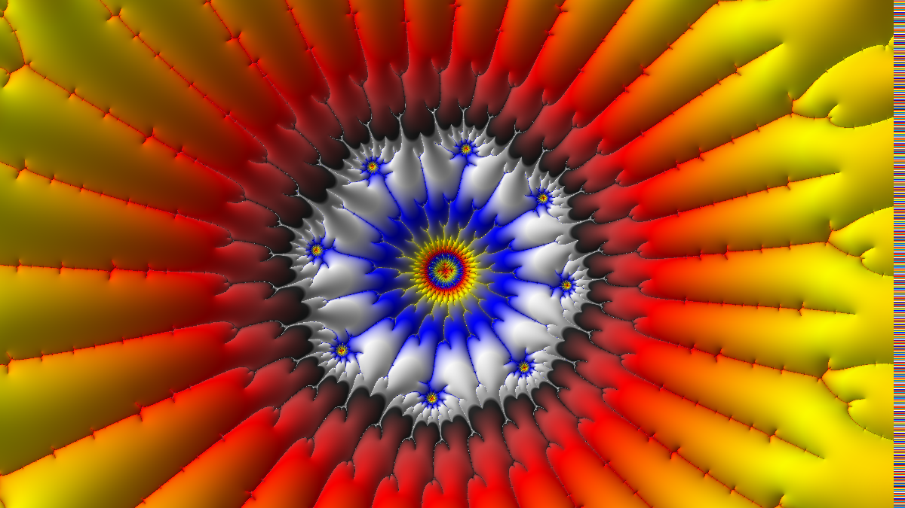
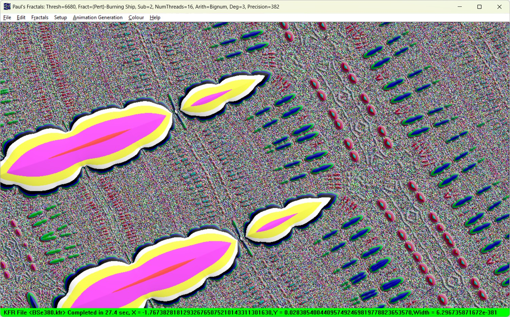
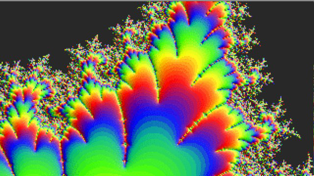

# ManpWIN

ManpWIN is a Windows fractal exploration and rendering application featuring advanced Mandelbrot and related fractal techniques including perturbation theory, optional Bilinear Approximation (BLA) acceleration, high-precision arithmetic, slope rendering, and a multithreaded formula parser.

The project combines decades of fractal development with a modern CMake-based build system, providing a powerful platform for both visual exploration and mathematical research into deep-zoom fractals and experimental formulae.

This repository contains a fully reproducible CMake-based build system supporting consistent Debug and Release builds with Visual Studio 2022.

---

## Version 4.05b

ManpWIN 4.05b is a colouring and rendering update focused on expanding
TieraZon and Flarium filter support, introducing the Clouds orbit-density
renderer, and improving filter behaviour and rendering status reporting.

---

## Recent Improvements (4.05b)

### TieraZon and Flarium Filters

* Fixed TieraZon filter behaviour across pixel-based fractals
* Added a number of additional filters adapted from Stephen C. Ferguson's Flarium program
* Fixed incorrect red/blue channel ordering in TieraZon and Flarium filters
* Repaired several legacy TieraZon and Flarium filters which were not producing correct results
* Corrected TieraZon filter precedence so TieraZon colouring takes priority over ordinary inside filters when appropriate

### Clouds Orbit-Density Rendering

* Added Clouds, an orbit-density rendering method based on an idea from Flarium
* Added Clouds support to both ordinary and perturbation rendering
* Added Linear Greyscale, Log Greyscale, Linear Palette, and Log Palette rendering modes
* Added a Clouds colour selector to the Fractal Options dialog
* Added palette colour support to Clouds rendering
* Automatically disables Bilinear Approximation (BLA) acceleration while Clouds is active so that all orbit visits are preserved in the density calculation
* Added saving and restoration of Clouds rendering settings in PAR files and animation scripts
* Added Clouds density-map merge progress reporting to the status bar

### Rendering and Documentation

* Fixed the status-bar pass display which could incorrectly report `Pass 0 of n` during multi-pass rendering
* Added new Help documentation for TieraZon, Flarium, and Clouds filters

---

## Previous Release Highlights (4.05a)

ManpWIN 4.05a was a maintenance update focused on parameter animation,
parameter-file persistence, and correct restoration of perturbation and
slope rendering parameters.

### Parameter Animation

* Fixed parameter animation following the parameter architecture changes introduced in ManpWIN 4.05
* Fixed Start Palette animation for perturbation and slope rendering
* Fixed bailout parameter animation for pixel, perturbation, and slope fractals
* Fixed preservation of the selected pre-palette colour when loading and running parameter animation scripts

### Parameter and PAR File Handling

* Fixed writing of `FDOptions` and `dStrands` to PAR files when used with TieraZon filters
* Fixed restoration of perturbation and slope runtime parameters when loading PAR files and animation scripts
* Corrected parameter handling so bailout animation parameters are kept separate from normal fractal parameters and pre-palette colour storage

---

## ✨ Features

* Mandelbrot and related fractals
* Extreme deep-zoom rendering using perturbation theory, with optional Bilinear Approximation (BLA) acceleration for improved performance
* Multithreaded rendering engine
* Multithreaded formula parser
* Slope derivative rendering modes
* Fractint palette support
* PNG export
* Advanced plotting modes
* Hypercomplex fractal support
* High-precision arithmetic (MPFR, double-double, quad-double)
* Template-based parser and arithmetic framework supporting unified fractal semantics
* Preservation of legacy algorithms with modern execution architecture
* True colour rendering
* Support for many fractal types including Mandelbrot, Julia, Burning Ship, and more
* TieraZon and Flarium orbit-based colouring filters
* Clouds orbit-density rendering with greyscale and palette-based display modes

---

## 🔬 Use Cases

ManpWIN is designed for both visual exploration and mathematical experimentation:

- Deep zoom Mandelbrot and fractal structure analysis
- Perturbation-based extreme scale rendering
- Investigation of orbit behaviour and numerical stability
- Custom formula experimentation via VM-based parser
- Educational demonstrations of fractal dynamics

---

## 🖼️ Example Output

### High-Precision Fractal Rendering



### ManpWIN Interface



## 🎬 Animation

[](Docs/videos/Jewels.webm)

👉 [Download animation file (WEBM, ~5 MB)](Docs/videos/Jewels.webm)

---

## 📊 Project Status

ManpWIN has reached a stable and reproducible build state with a fully functional multithreaded rendering pipeline.

### Current State

- ✔ Deterministic rendering across Mandelbrot, perturbation, and formula modes
- ✔ Stable multithreaded execution (worklist + parser)
- ✔ Verified Debug and Release builds via CMake + Visual Studio 2022
- ✔ Verified extreme deep zoom rendering using perturbation theory and high-precision arithmetic
- ✔ Ongoing collaboration and interest from the mathematical community
- ✔ Improved numerical stability across multiple arithmetic types (MPFR, DD, QD)

---

## 🏗️ Build Requirements

- Windows 10/11  
- Visual Studio 2022 (with C++ tools)  
- CMake ≥ 3.23  
- vcpkg installed at:

```text
C:\vcpkg
```
---

## ⚙️ Build Instructions

### 1. Clone repository

```bat
git clone https://github.com/PaulTheLionHeart/manpwin.git
cd manpwin
```

---

### 2. Configure (CMake + vcpkg)

```bat
  cmake -B build -S . ^
  -DCMAKE_TOOLCHAIN_FILE=C:/vcpkg/scripts/buildsystems/vcpkg.cmake ^
  -DVCPKG_TARGET_TRIPLET=x64-windows-static
```


The `x64-windows-static` triplet is recommended because it produces a self-contained executable without requiring MPFR or other third-party runtime DLLs.

---

### 3. Build

Release:
```bat
cmake --build build --config Release
```

Debug:
```bat
cmake --build build --config Debug
```

---

### 4. Run

Release:
```bat
build\Release\ManpWIN64.exe
```

Debug:
```bat
build\Debug\ManpWIN64.exe
```

---

### Alternative (recommended)

```bat
build_release.bat
build_debug.bat
```

---

## 📁 Project Structure

```
ManpWIN/
├─ ManpWIN64/     # Main application sources
├─ parser/        # Formula parser engine
├─ pnglib/        # PNG implementation
├─ ZLib/          # Compression support
├─ qdlib/         # Quad-double arithmetic
├─ MPEG/          # MPEG support
├─ CMakeLists.txt # Root build configuration
```

### External Dependencies (via vcpkg)

- MPFR
- GMP
- libpng
- zlib

---

## 🧯 Troubleshooting

**Missing pnglib.lib:**  
Reconfigure CMake and ensure pnglib builds as STATIC.

**MPFR / GMP errors:**  
Ensure vcpkg is installed and toolchain is set.

**Blank screen:**  
Ensure .rc files are included.

**Debug vs Release mismatch:**  
Check runtime library consistency.

---

## 🐉 Dragon Slayer Timeline

A chronological record of major battles during the ManpWIN modernisation.

- 🐲 Repository archaeology — removed legacy and duplicate source files  
- ⚔️ CMake resurrection — rebuilt modular build architecture  
- 🧱 pnglib integration — fixed missing target + linker language issues  
- 🔗 MPFR linking battle — resolved dependency integration via vcpkg  
- 🪟 Resource restoration — fixed blank screen by restoring `.rc` compilation  
- 🧠 Parser evolution — multithreaded formula parser stabilised  
- 🎯 Plotting expansion — new slope rendering + plotting modes added  
- 🐛 Debug infinite loop hunt — tracked worklist spin behaviour  
- 🎨 Palette parser fix — vector migration introduced subtle indexing bug  
- 🧩 Solid guessing initialization bug — uninitialised variable causing lock  
- ⚙️ CRT conflict resolution — `/NODEFAULTLIB:LIBCMTD` investigation  
- 🏰 First stable reproducible CMake build — Debug + Release verified  
- 🏷 Milestone tagged — historic stabilisation snapshot captured  
- 🧭 Stability phase reached — deterministic behaviour restored  
- 🔬 Research interest — project now attracting mathematical exploration  
- 🐉 Perturbation dragon — fixed uninitialised power causing incorrect rendering after toggling  
- 🧮 Arithmetic stabilisation — improved trig behaviour across DD/QD/MPFR  
- 🧱 Template foundation — introduced templated framework for future fractal expansion  
- 🧠 Semantic unification — parser/trig arithmetic consolidated via templates
- 🐉 Layer discipline restored — VM, dispatch, and semantic layers separated cleanly
- 🔮 Transcendental perturbation groundwork — infrastructure prepared for future symbolic perturbation research
- 📊 Status Information modernisation — improved progress reporting and diagnostics
- 🧵 Thread progress overhaul — status reporting now reflects the slowest active worker thread
- 📚 Documentation refresh — Status Information help page and keyboard documentation updated
- 🧭 Deep zoom expedition — tracked and eliminated long-standing perturbation teleporting
- 🛰 Reference orbit refinement — improved perturbation reference generation and rebasing
- 🧩 Hidden missing `else` — restored correct rebasing when BLA is disabled
- 🌊 KFR smoothing restored — preserved smoothing values when reading and writing `.KFR` files
- 📋 Metadata consistency — parameter dialogues now correctly rebuild fractal metadata across all new fractal families
- 🧮 DD/QD trig repair — fixed transcendental arithmetic issues affecting TieraZon fractals
- 🧊 3D rendering restored — corrected effective thread handling in pixel and perturbation modes
- 🧵 Thread lifecycle cleanup — removed completion races and simplified worker startup/shutdown handling
- 🐉 CPixel audit — verified strip ownership, symmetry, worklists, arithmetic initialisation, and rendering lifecycle
- 🎨 Filter unification — shared ordinary filter behaviour across pixel, perturbation, and derivative slope rendering
- 💡 Slope lighting preserved — filters and biomorphs now work with derivative slope without replacing slope illumination
- 🎨 Palette cleanup — corrected palette start, offset, and shift handling and added configurable pre-palette colouring
- 🔄 Fractal interoperability — improved conversion between equivalent pixel and perturbation fractals
- 🧮 Polynomial expansion — Perturbation Polynomial extended to eighth order
- 🐉 Power distortion slain — fixed long-standing reference-orbit distortion caused by fractal degree being established too late
- 🧩 Parameter architecture — expanded perturbation and slope parameters, updated dialogue and animation handling, and simplified parameter-file persistence
- 🎞 Parameter animation repair — restored normal parameter, Start Palette, and bailout animation after the 4.05 parameter architecture changes
- 📋 Parameter persistence repair — corrected TieraZon `FDOptions` and `dStrands` PAR handling and restored perturbation/slope runtime state from PAR and animation files
- 🎨 Pre-palette colour preservation — ensured the selected start colour survives parameter animation and parameter-file loading
- 🎨 TieraZon filter repair — corrected colouring behaviour, channel ordering, precedence, and several legacy filters
- 🧪 Flarium expansion — added additional Stephen C. Ferguson filter algorithms to ManpWIN
- ☁️ Clouds arrive — introduced orbit-density rendering based on the Flarium Clouds idea
- 🎨 Clouds colour modes — added linear/logarithmic greyscale and palette rendering
- 🧮 Perturbation Clouds — extended orbit-density rendering to the perturbation engine
- 🚀 BLA safety — automatically bypassed Bilinear Approximation when Clouds requires every orbit visit
- 🧵 Density merge reporting — added progress reporting while per-thread Clouds density maps are combined
- 📊 Pass display repair — fixed the long-standing `Pass 0 of n` status display
- 📚 Clouds documentation — added dedicated TieraZon, Flarium, and Clouds Help documentation

---

## 🤝 Contributing Notes

- Never commit build directory
- Tag stable milestones
- Keep Debug and Release working
- Prefer incremental commits

---

## 🏆 Milestone

First stable reproducible CMake build achieved.

## 🔁 Reproducibility

---

A key goal of the modernisation effort is reproducibility:

- Clean CMake-based builds
- Controlled dependency handling via vcpkg
- Verified Debug and Release parity
- Deterministic rendering across runs (within current numerical limits)

---

## 🙏 Credits

<table>
<tr>
<td align="center">
<br>
<b>Paul the LionHeart</b><br>
<br>
<sub>Author</sub>
</td>

<td align="center">
<br>
<b>ChatGPT</b><br>
<br>
<sub>Workshop Assistant</sub>
</td>
</tr>
</table>
